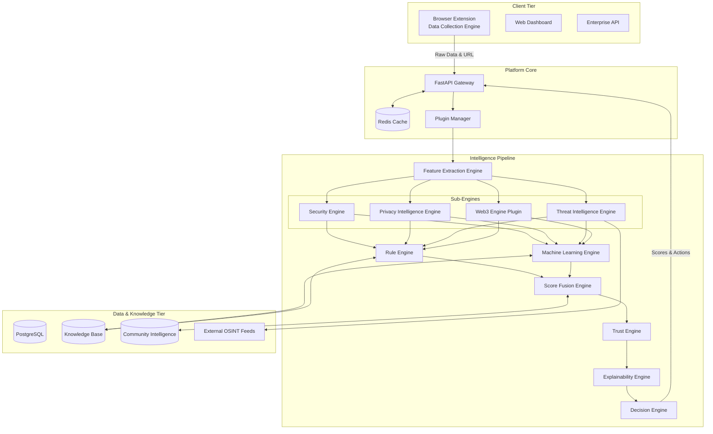

# 03 System Architecture

## 1. High-Level Architecture
The TrustLens AI Platform is built as a highly modular, decoupled architecture centered around a core processing pipeline and a Plugin Manager. This allows the platform to serve multiple clients (Extension, Dashboard, Enterprise APIs) while easily integrating new analysis domains (e.g., Web3).

The architecture consists of four primary tiers:
1. **Client Tier:** Data Collection Engines (Browser Extension, Mobile App) and user interfaces.
2. **Platform Core (API & Plugin Manager):** FastAPI gateway, caching, and the Plugin Architecture.
3. **Intelligence Pipeline (The Engines):** The sequential chain of extraction, analysis, fusion, and decision-making.
4. **Data & Knowledge Tier:** Databases, the Knowledge Base, and Community Intelligence.

## 2. C4 Model: Container Diagram

## 3. Component Interactions

### 3.1. The Analysis Pipeline
When a request enters the platform, it follows a strict pipeline (see [Data Flow](./15_DATA_FLOW.md)):
1. **Data Collection Engine** (Client) sends raw payload.
2. **Feature Extraction Engine** normalizes this into feature vectors.
3. **Sub-Engines** (Security, Privacy Intelligence, Threat Intelligence, Web3) process features in parallel based on active plugins.
4. **Rule Engine & Machine Learning Engine** apply deterministic rules and probabilistic models.
5. **Score Fusion Engine** merges outputs into Security, Privacy, Web3 scores and calculates a Confidence Score.
6. **Trust Engine** normalizes these into an Overall Trust Score based on entity reputation.
7. **Explainability Engine** translates findings into human-readable text.
8. **Decision Engine** generates the final recommendation, severity level, and user action.

## 4. Plugin Architecture
The Platform Core utilizes a **Plugin Manager**. Sub-engines are treated as plugins.
- **Core Plugins:** Security, Privacy Intelligence, Threat Intelligence.
- **Domain Plugins:** Web3 (active only on crypto sites).
- **Future Plugins:** Banking, Shopping, Healthcare (specialized analysis engines).
This ensures the ML and Fusion engines only process data relevant to the user's current context, saving compute and improving accuracy.

## 5. Related Documents
- [Project Structure](./04_PROJECT_STRUCTURE.md)
- [Data Flow](./15_DATA_FLOW.md)
