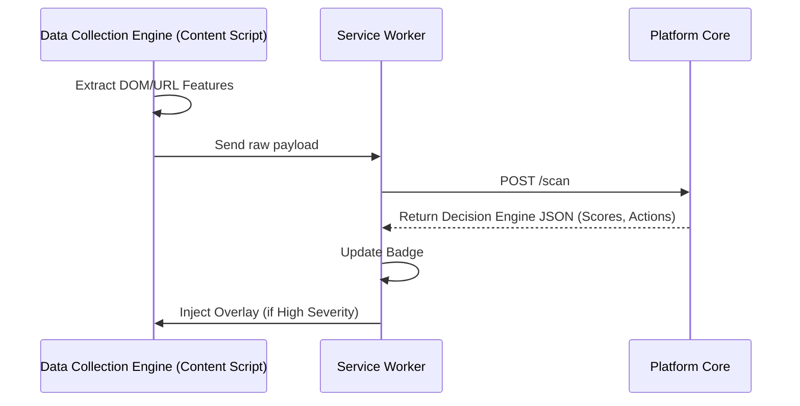

# 07 Extension Architecture

## 1. Overview
In the TrustLens AI Platform, the Browser Extension serves primarily as a **Data Collection Engine** client and a UI rendering surface. It is intentionally "dumb," offloading all complex analysis, scoring, and decision-making to the backend engines.

## 2. Core Responsibilities

### 2.1. Data Collection Engine (Content Scripts)
- Injected into every web page.
- Extracts raw data: URL, basic DOM structure (forms, iframes), active network scripts.
- Packages this into a normalized JSON payload and sends it to the FastAPI backend via the Service Worker.
- *Strictly avoids capturing PII or the actual contents of input fields.*

### 2.2. Event Orchestration (Service Worker)
- `background.ts` listens for `chrome.webNavigation.onCompleted`.
- Handles communication with the API.
- Receives the final, compiled JSON from the **Decision Engine**.
- Modifies the extension Badge color/icon based on the Decision Engine's output.

### 2.3. UI Rendering (Popup & Overlays)
- Renders the multi-dimensional scores (Security, Privacy, Web3, Trust) in the Popup.
- Displays the Analysis Timeline to the user.
- If the Decision Engine returns a "High Severity" action, the Content Script injects a full-page HTML overlay warning the user not to proceed.

## 3. Communication Flow

## 4. Privacy Constraints
The extension is designed to maintain user privacy. Because the backend **Threat Intelligence Engine** tracks IPs, the extension must only transmit structural data, never user inputs. 
