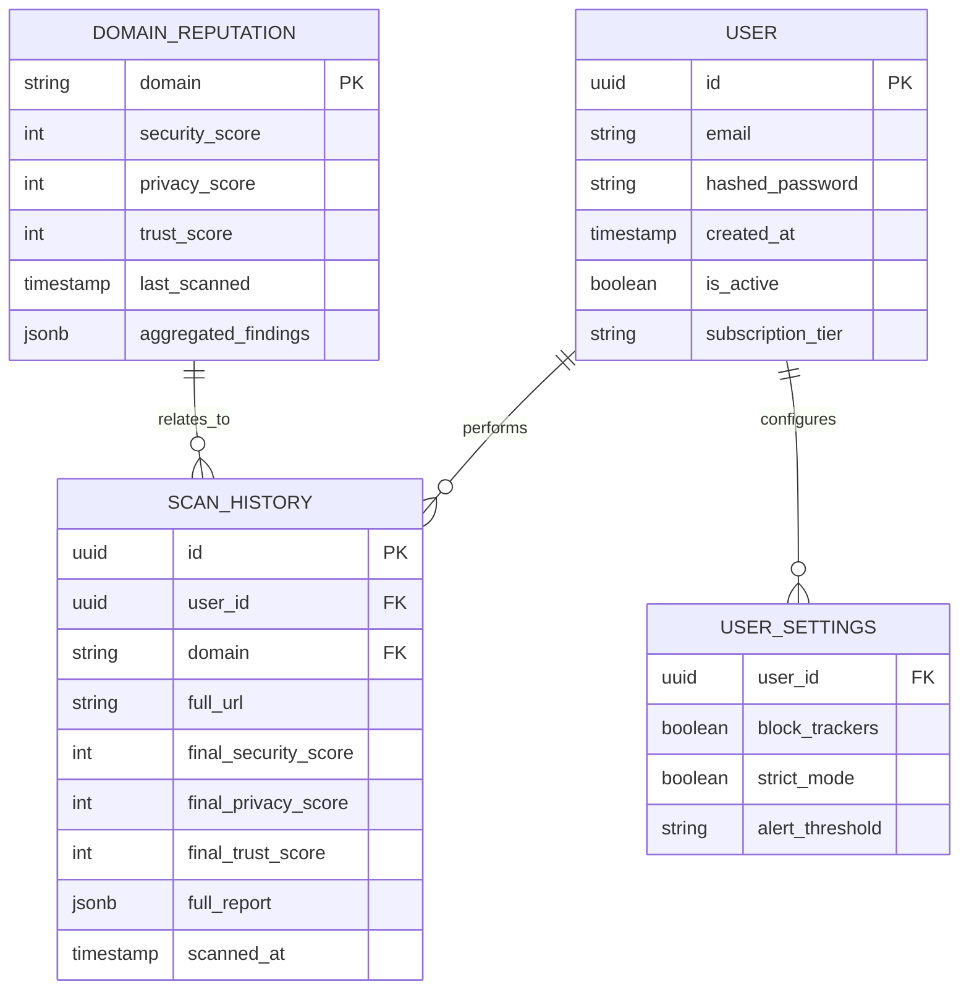

# 13 Database Design

## 1. Overview
TrustLens AI uses PostgreSQL for persistent data storage (user profiles, scan history) and Redis for caching and rate limiting. We use SQLAlchemy 2.0 (Async) as the ORM.

## 2. Entity Relationship Diagram (ERD)

## 3. Table Definitions

### 3.1. `users`
Stores authentication and basic profile data.
- **Indexes:** Unique index on `email`.

### 3.2. `user_settings`
1-to-1 relationship with `users`. Stores UI and scanning preferences.

### 3.3. `domain_reputation`
The central intelligence table. Stores the most recent aggregated scores for a root domain (e.g., `amazon.com`).
- **Why?** If 1,000 users visit a domain, we don't need to recalculate the baseline reputation every time.
- **`aggregated_findings` (JSONB):** Stores the critical reasons for the score (e.g., `["Valid EV SSL", "Domain age > 20 years"]`) to serve fast explainability without hitting the engines.
- **Indexes:** Primary key on `domain`.

### 3.4. `scan_history`
An append-only ledger of every scan requested by a user.
- **Why?** Powers the Web Dashboard analytics.
- **`full_report` (JSONB):** Stores the complete output of the Orchestrator for that specific URL at that specific time.
- **Indexes:** B-Tree index on `user_id` and `scanned_at` for fast dashboard queries. Partitioning by month is recommended for production scaling.

## 4. Redis Caching Schema
Redis is used heavily to prevent DB/API bottlenecks.

- `trustlens:ratelimit:api:{user_id}` (Token bucket for rate limiting)
- `trustlens:cache:domain:{domain}` (TTL 24h) -> JSON string of `DOMAIN_REPUTATION`
- `trustlens:cache:url:{hash(url)}` (TTL 1h) -> JSON string of `SCAN_HISTORY.full_report`
- `trustlens:task:{task_id}` -> Status of async background tasks (e.g., LLM processing)

## 5. Migration Strategy
We use **Alembic** for managing database schema migrations. All changes to SQLAlchemy models must be accompanied by an auto-generated Alembic revision.
