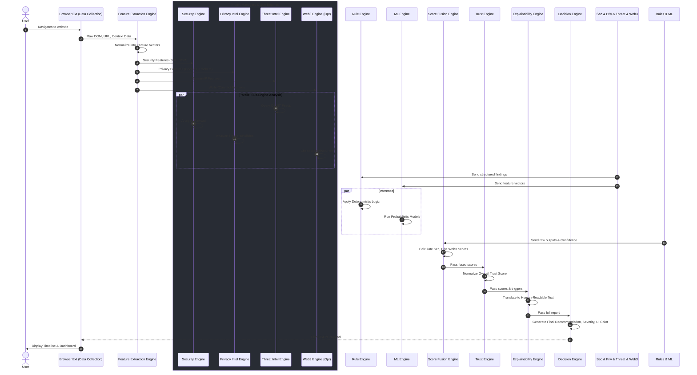

# 15 Data Flow Pipeline

## 1. Overview
The TrustLens AI Platform relies on a highly structured, sequential processing pipeline to evaluate websites. This document maps the journey of data from the client, through the various engines, to the final decision.

## 2. The Analysis Pipeline

## 3. User-Facing Analysis Timeline
While the pipeline executes backend logic, the Decision Engine transmits status updates back to the client to render a user-facing timeline, building trust in the platform's thoroughness:

- ✔ Data Collected
- ✔ Features Extracted
- ✔ Threat Databases Queried (Threat Intel Engine)
- ✔ Privacy Policy Analyzed (Privacy Intel Engine)
- ✔ Smart Contracts Audited (Web3 Engine - *if applicable*)
- ✔ AI Analysis Complete (Machine Learning Engine)
- ✔ Recommendation Generated (Decision Engine)

## 4. Pipeline Engine Responsibilities
- **Feature Extraction Engine:** Converts messy raw data into clean, structured arrays (e.g., `has_password_field: 1`, `url_entropy: 4.2`).
- **Score Fusion Engine:** Handles the complex weighting (e.g., ML says 80% safe, Rule Engine found a critical VirusTotal hit -> Fusion overrides ML based on rule weights).
- **Decision Engine:** The final gatekeeper that dictates exactly how the extension or dashboard should alert the user (e.g., "Show a Red overlay banner with Priority 1").
